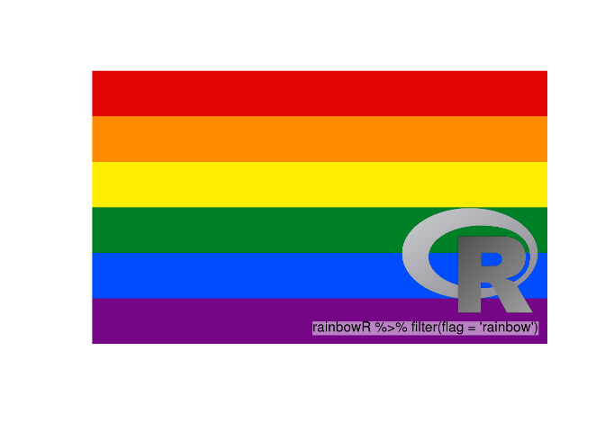
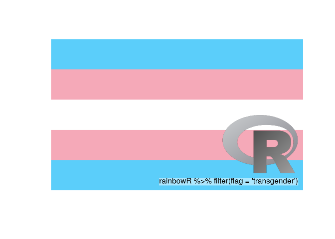
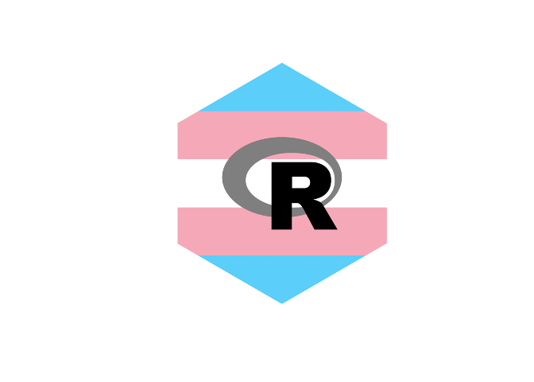
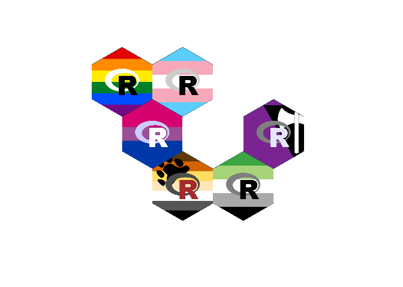

<!-- README.md is generated from README.Rmd. Please edit that file -->

# rainbowr

<!-- badges: start -->

[](https://travis-ci.org/djnavarro/rainbowr)
[](https://www.tidyverse.org/lifecycle/#experimental)
[](https://cran.r-project.org/package=rainbowr)
<!-- badges: end -->

The `rainbowr` package generates LGBT pride flags overlaid with the R
logo

## Installation

The package can be installed from [GitHub](https://github.com/) with:

``` r
# install.packages("devtools")
devtools::install_github("djnavarro/rainbowr")
```

## Example 1: LGBT banners

``` r
library(magick)
#> Linking to ImageMagick 6.9.7.4
#> Enabled features: fontconfig, freetype, fftw, lcms, pango, x11
#> Disabled features: cairo, ghostscript, rsvg, webp
library(rainbowr)
#> 🌈

rainbow_flag <- make_banner("rainbow")
plot(rainbow_flag)
```



``` r

trans_flag <- make_banner("transgender")
plot(trans_flag)
```



The flags are taken from the Wikipedia page for [LGBT
symbols](https://en.wikipedia.org/wiki/LGBT_symbols) and the Wikicommons
page for [Sexual identity
symbols](https://commons.wikimedia.org/wiki/Sexual_identity_symbols),
but is not exhaustive. To see which flags are included:

``` r
list_flags()
#>  [1] "agender"          "aromantic"        "asexual"         
#>  [4] "bear"             "bisexual"         "demisexual"      
#>  [7] "genderfluid"      "genderqueer"      "intersex"        
#> [10] "lesbian"          "lipstick_lesbian" "nonbinary"       
#> [13] "pansexual"        "polyamory"        "polysexual"      
#> [16] "rainbow"          "transgender"      "twink"
```

## Example 2: LGBT hexes

``` r
rainbow_hex <- make_hex("rainbow")
plot(rainbow_hex)
```


``` r

trans_hex <- make_hex("transgender", palette = c("grey50", "black"))
plot(trans_hex)
```



## Example 3: Tiled LGBT hexes

``` r
df <- data.frame(
  flag = c("rainbow", "transgender", "bisexual", "bear", "aromantic", "lesbian"),
  palette1 = c("white", "grey80", "#ccccff", "grey30", "grey50", "grey50"),
  palette2 = c("black", "black", "white", "brown", "black", "lavender"),
  row = c(1, 1, 2, 3, 3, 2),
  col = c(1, 2, 1, 2, 3, 3),
  stringsAsFactors = FALSE
)

hextile <- make_hextile(df)
#> adding rainbow hex (1 of 6)
#> adding transgender hex (2 of 6)
#> adding bisexual hex (3 of 6)
#> adding bear hex (4 of 6)
#> adding aromantic hex (5 of 6)
#> adding lesbian hex (6 of 6)
plot(hextile)
```


